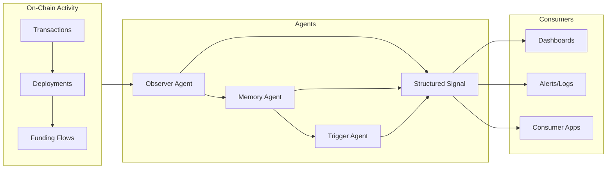

# Eremos


[](https://opensource.org/licenses/MIT)
[](https://github.com/EremosCore/Eremos/graphs/contributors)
[](https://twitter.com/EremosCore)
[](https://solana.com/)
[](https://docs.solana.com/developing/on-chain-programs)
[](https://github.com/EremosCore/Eremos/actions)


**Autonomous swarm agents for early on-chain signal detection**

Eremos is a lightweight framework for deploying modular agents that monitor blockchain activity - tracking wallet clusters, mint patterns, and contract anomalies. Designed for devs who want low-noise, early signals embedded into their workflows.

## Table of Contents
- [Features](#features)
- [Example Signal](#example-signal)
- [Signal Confidence](#signal-confidence)
- [Tech Stack](#tech-stack)
- [Getting Started](#getting-started)
- [Key Folders](#key-folders)
- [Contributing](#contributing)
- [License](#license)
- [Links](#links)

---

<p align="center">
  <br/>
  <em>Theron - Agent (000)</em>
</p>

**Meet Theron - Agent-000**  
*The first deployed agent in the swarm. Passive. Pattern-sensitive.  
Modular and extendable by design.*

**Agent-001 Coming Soon** [Teaser #1](https://x.com/EremosCore/status/1949154939923833239), [Teaser #2](https://x.com/EremosCore/status/1954856345284567218)

---

## Features

Eremos empowers Solana devs with autonomous agents that deliver actionable insights. Key features include:

| Feature                  | Description                                                                 |
|--------------------------|-----------------------------------------------------------------------------|
| **Modular Agents**       | Scoped logic for detecting wallet activity, contract spawns, and anomalies. |
| **Signal Emission**      | Structured signals for logging, alerting, or downstream integration.        |
| **Swarm Design**         | Independent agents with shared utilities for scalable monitoring.           |
| **Extensible Core**      | Easily plug in custom watchers, inference layers, or triggers.              |
| **Minimal Output**       | Logs only high-relevance signals to reduce noise.                           |
| **Launch Wallet Detection** | Traces fresh funding from CEXs (e.g., Kraken) and flags high-confidence deploys in real-time. |
| **Ghost Watcher**        | Monitors dormant wallets for sudden activity, spotting potential rugs or dev revivals. |
| **And More**             | Upcoming agents for NFT mints, DeFi pools, and memecoin patterns.           |


---
## Architecture


---
## Example Signal

An example signal emitted by an agent detecting a live token deployment:

```ts
[agent-observer] → fresh funding detected from kraken (wallet: 6Yxk...P2M8) at 04:41:12Z
[agent-observer] → contract probing detected within 4s (pump.fun interaction traced)
[agent-observer] → token created at 04:41:17Z (tx: 5gW...pump)
[agent-observer] → 5 bundle-linked wallets interacted within 8s of deploy
[agent-observer] → launch confidence spike (0.91) - emitting signal (elapsed: 13s)

{
  agent: "Observer",
  type: "launch_detected",
  glyph: "Δ",
  hash: "sig_c7f9a3d2bc",
  timestamp: "2025-06-12T04:41:25Z",
  source: "agent-observer",
  confidence: 0.91
}
```

---

## Signal Confidence

Each emitted signal includes a `confidence` score (0-1) based on behavioral heuristics:
- CEX-origin funding (e.g. Kraken, Coinbase)
- Time between funding → deploy
- Wallet linkage density (bundled activity)
- Token metadata validation

Confidence is computed via agent-side scoring and logged alongside the signal.

---

## Tech Stack

- **Frontend:** Next.js, Tailwind CSS
- **Backend:** Node.js (TypeScript-based agent runner)
- **Language:** TypeScript (typed logic across agents, utils, and infra)
- **Chain Layer:** RPC watchers, mempool filters, native triggers

---

## Getting Started

```bash
git clone https://github.com/EremosCore/Eremos.git
cd Eremos
npm install
```

Set up your environment:

```bash
cp .env.example .env.local
```
Configure your Solana RPC in .env.local (e.g., RPC_URL=https://api.mainnet-beta.solana.com) for real-time agent monitoring
```bash
npm run dev
```

---

## Key Folders

- `/agents` - Agent templates + logic  
- `/utils` - Shared signal/logging utilities  
- `/types` - TypeScript interfaces + definitions  
- `/scripts` - Bootstrap and dev scripts  
- `/docs` - Swarm structure, architecture, & our artwork/official whitepaper

---

## Contributing

We’re open to contributors.
If you are experienced in TypeScript and like agent-based systems, check example.ts and build your own observer. If you're a designer, artist, or just have ideas that fit the mythos - send us a DM on Twitter. @EremosCore

---

## License
MIT © Eremos LLC


---

## Links

[](https://github.com/EremosCore/Eremos/commits/main)
[](https://github.com/EremosCore/Eremos/pulls)
[](https://www.typescriptlang.org/)

- **Twitter/X:** [@EremosCore](https://x.com/EremosCore)  
- **Website:** [Eremos.io](https://www.eremos.io/)  
- **Whitepaper:** [v1.0 PDF](docs/whitepaper.pdf)  

_Maintained by the Eremos Core team 💛._
