# Eremos

<p align="center">
  
</p>

**Autonomous Swarm Agents for Early On-Chain Signal Detection**

[](https://github.com/EremosCore/Eremos/stargazers)
[](https://github.com/EremosCore/Eremos/network/members)
[](LICENSE)
[](https://github.com/EremosCore/Eremos/commits/main)

---

## 📚 Table of Contents
- [Project Overview](#project-overview)
- [Architecture](#architecture)
- [Swarm Agents](#swarm-agents)
- [Signal Flow](#signal-flow)
- [Features](#features)
- [Example Signal](#example-signal)
- [Signal Confidence](#signal-confidence)
- [Tech Stack](#tech-stack)
- [Quickstart](#quickstart)
- [Key Folders](#key-folders)
- [Contributing](#contributing)
- [License](#license)
- [Links](#links)

---

## 🚀 Project Overview
Eremos is a lightweight, modular framework for deploying autonomous swarm agents that monitor Solana blockchain activity. Each agent specializes in tracking wallet clusters, mint patterns, and contract anomalies, providing early, low-noise signals for developers and analysts. Eremos solves the problem of high-signal, low-latency on-chain monitoring by allowing you to embed custom agents directly into your workflow.

---

## 🏗️ Architecture

```mermaid
graph TD
  subgraph Swarm Agents
    A1[Ϸ Theron<br/><sub>memory_vault</sub>]
    A2[Δ Observer<br/><sub>surveillance</sub>]
    A3[λ Harvester<br/><sub>indexing</sub>]
  end
  B[Solana On-Chain Data]
  U[Shared Utilities & Types]
  S[Signal Output]

  B -- Watches --> A1
  B -- Watches --> A2
  B -- Watches --> A3
  A1 -- Emits --> S
  A2 -- Emits --> S
  A3 -- Emits --> S
  A1 -- Uses --> U
  A2 -- Uses --> U
  A3 -- Uses --> U
```



Agents independently monitor on-chain events, emit structured signals, and share core utilities. The architecture is designed for extensibility and minimal output noise.

---

## 🤖 Swarm Agents

| Agent      | Glyph | Role           | Watches           |
|------------|:-----:|:--------------:|:-----------------:|
| **Theron** | Ϸ     | memory_vault   | anomaly_detection |
| **Observer** | Δ   | surveillance   | wallet_activity   |
| **Harvester** | λ  | indexing       | mint_activity     |

---

## 🔄 Signal Flow

```mermaid
flowchart LR
    B[Solana On-Chain Data]
    subgraph Agents
      T[Ϸ Theron]
      O[Δ Observer]
      H[λ Harvester]
    end
    style T fill:#f5f5f5,stroke:#b3b3b3
    style O fill:#f5f5f5,stroke:#b3b3b3
    style H fill:#f5f5f5,stroke:#b3b3b3
    B -- Event --> T
    B -- Event --> O
    B -- Event --> H
    T -- Signal --> S[Signal Output]
    O -- Signal --> S
    H -- Signal --> S
    S -- Downstream --> U[User/Alert/Log]
```



---

## ✨ Features
- **Modular Agents** – Scoped logic for detecting wallet activity, contract spawns, and anomalies
- **Signal Emission** – Structured signals for logging, alerting, or downstream use
- **Swarm Design** – Each agent operates independently with shared utilities
- **Extensible Core** – Plug in watchers, inference layers, or custom triggers
- **Minimal Output** – Log only what matters
- **Launch Wallet Detection** – Trace freshly funded wallets, track contract interactions, and flag high-confidence deploys in real time
- **Ghost Watcher** – Monitors long-dormant wallets that suddenly become active again

---

## 📝 Example Signal

[agent-observer] → fresh funding detected from kraken (wallet: 6Yxk...P2M8) at 04:41:12Z
[agent-observer] → contract probing detected within 4s (pump.fun interaction traced)
[agent-observer] → token created at 04:41:17Z (tx: 5gW...pump)
[agent-observer] → 5 bundle-linked wallets interacted within 8s of deploy
[agent-observer] → launch confidence spike (0.91) - emitting signal (elapsed: 13s)

```json
{
  "agent": "Observer",
  "type": "launch_detected",
  "glyph": "Δ",
  "hash": "sig_c7f9a3d2bc",
  "timestamp": "2025-06-12T04:41:25Z",
  "source": "agent-observer",
  "confidence": 0.91
}
```

---

## 📊 Signal Confidence

Each emitted signal includes a `confidence` score (0–1) based on behavioral heuristics:

- CEX-origin funding (e.g. Kraken, Coinbase)
- Time between funding → deploy
- Wallet linkage density (bundled activity)
- Token metadata validation

Confidence is computed via agent-side scoring and logged alongside the signal.

---

## 🛠️ Tech Stack

- **Language:** TypeScript (typed logic across agents, utils, and infra)
- **Runtime:** Node.js (TypeScript-based agent runner)
- **Testing:** Jest with TypeScript support
- **Linting:** ESLint with Prettier formatting
- **Chain Layer:** RPC watchers, mempool filters, native triggers

---

## ⚡ Quickstart

1. **Clone the repository**
   ```bash
   git clone https://github.com/EremosCore/Eremos.git
   cd Eremos
   ```
2. **Install dependencies**
   ```bash
   npm install
   ```
3. **Set up your environment**
   - (If required) Copy and configure your environment file:
     ```bash
     # cp .env.example .env.local
     # Edit .env.local as needed
     ```
4. **Run an agent**
   ```bash
   npm run dev
   # Or run a specific agent script if available
   ```

## Development

```bash
# Run tests
npm test

# Run tests in watch mode
npm run test:watch

# Lint code
npm run lint

# Format code
npm run format

# Build the project
npm run build

# Validate agents
npm run validate

# Generate new agent
npm run generate:agent
```

---

## 📁 Key Folders
- `/agents` – Agent templates & logic
- `/utils` – Shared signal/logging utilities
- `/types` – TypeScript interfaces & definitions
- `/scripts` – Bootstrap and dev scripts
- `/docs` – Swarm structure, architecture, & whitepaper

---

## 🤝 Contributing

We welcome contributors! If you're experienced in TypeScript or agent-based systems, check `/agents/example.ts` and build your own observer. For details, see [CONTRIBUTING.md](CONTRIBUTING.md).

We're open to contributors! Here's how to get started:

1. **Fork the repository**
2. **Set up your development environment:**
   ```bash
   npm install
   cp env.example .env.local
   npm run lint
   npm test
   ```
3. **Create a new agent or improve existing ones**
4. **Follow our coding standards:**
   - Run `npm run lint` before committing
   - Add tests for new functionality
   - Use TypeScript for all new code
5. **Submit a pull request**

If you're experienced in TypeScript and like agent-based systems, check `agents/example.ts` and build your own observer.
If you're a designer, artist, or just have ideas that fit the mythos - send us a DM on Twitter. [@EremosCore](https://x.com/EremosCore)

Designers, artists, or those with ideas fitting the mythos—DM us on Twitter [@EremosCore](https://x.com/EremosCore).

---

## 📜 License
MIT © Eremos

---

## 🔗 Links
- **Twitter/X:** [@EremosCore](https://x.com/EremosCore)
- **Website:** [Eremos.io](https://www.eremos.io/)
- **Whitepaper:** [v1.0 PDF](docs/whitepaper.pdf)

_Maintained by the Eremos Core team 💛._
