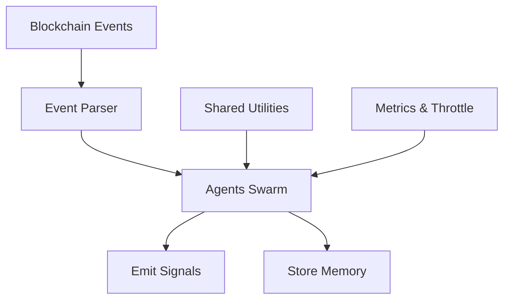

# Eremos Architecture

Eremos is a swarm-style agent framework for passive blockchain observation.

Each agent:

- Has a role (`observer`, `memory`, `trigger`, `+ more to come`)
- Watches a specific event type
- Emits structured signals
- Optionally stores memory

Shared utilities and types define common structure across agents.  
Signals are deterministic and lightweight — not reactive.

> Agent communication and orchestration are coming soon.

## System Diagram

To better understand the architecture, here's a simple flowchart:

This diagram shows how events are parsed and observed by the swarm of agents, which then emit signals and store memory, utilizing shared utilities.
