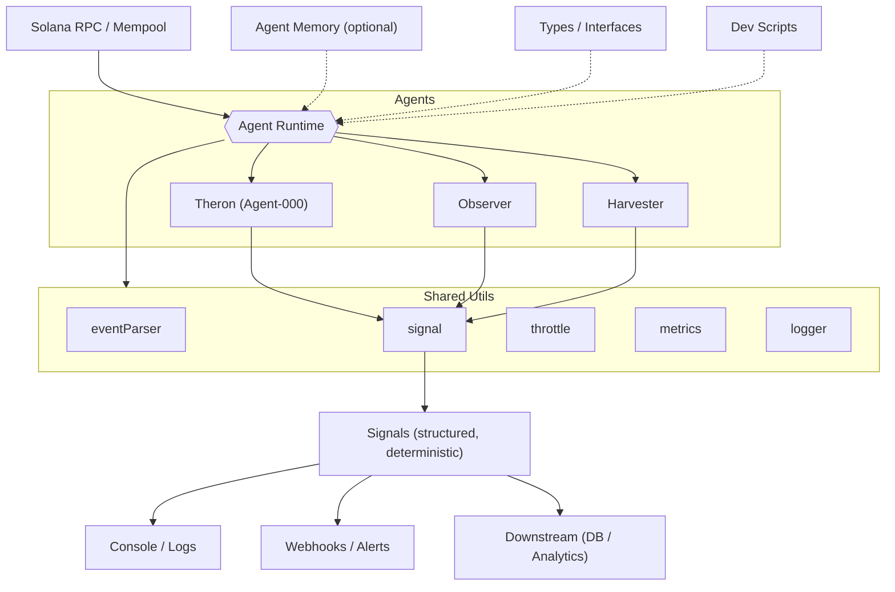

# Eremos Architecture

Eremos is a swarm-style agent framework for passive blockchain observation.

Each agent:
- Has a role (`observer`, `memory`, `trigger`, `+ more to come`)
- Watches a specific event type
- Emits structured signals
- Optionally stores memory

Shared utilities and types define common structure across agents.  
Signals are deterministic and lightweight — not reactive.

> Agent communication and orchestration are coming soon.

## Simple Architecture

At a high level, agents observe on-chain activity, use shared utilities to parse events and score behavior, and emit deterministic signals for downstream use.

- **Solana RPC/Mempool** → provides raw on-chain events
- **Agents** → encapsulate detection logic (e.g., Observer, Theron)
- **Shared Utils** → parsing, signals, metrics, throttling, logging
- **Signals** → structured, deterministic outputs
- **Outputs** → logs, webhooks, or downstream analytics

