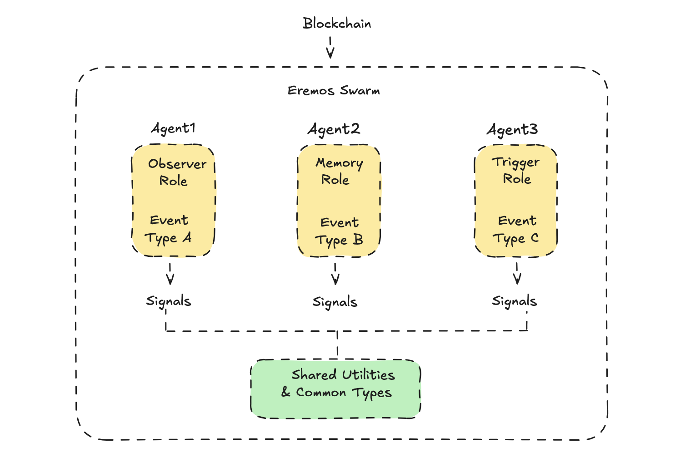

# Eremos Architecture

Each agent has a specialized role:  
- `observer`: Monitors specific blockchain events.  
- `memory`: Stores event data or state. 
- `trigger`: Emits signals to external systems (e.g., alerts) based on observed events.  

More roles may be added for extensibility.

Shared utilities and types define a common structure across agents.  
Signals are deterministic and lightweight — not reactive.

> Agent communication and orchestration are coming soon.
