# 🏗️ Eremos Architecture

<div align="center">

**Deep dive into the swarm-style agent framework for passive blockchain observation**

[](https://github.com/EremosCore/Eremos)
[](https://solana.com/)

</div>

## 📋 Table of Contents

- [🎯 System Overview](#-system-overview)
- [🤖 Agent Architecture](#-agent-architecture)
- [📡 Signal Flow](#-signal-flow)
- [🧠 Memory System](#-memory-system)
- [⚙️ Runtime Layer](#️-runtime-layer)
- [🔄 Event Processing Pipeline](#-event-processing-pipeline)
- [🌐 System Components](#-system-components)
- [🚀 Future Architecture](#-future-architecture)

## 🎯 System Overview

Eremos implements a **swarm-style agent framework** for passive blockchain observation on Solana. The architecture prioritizes:

- **Modularity**: Independent agents with specialized detection logic
- **Scalability**: Horizontal scaling through agent distribution
- **Reliability**: Fault-tolerant design with isolated agent failures
- **Extensibility**: Plugin-based architecture for custom behaviors

### Core Design Principles

```mermaid
graph TD
    A[Blockchain Events] --> B[Event Router]
    B --> C[Agent Swarm]
    C --> D[Signal Aggregator]
    D --> E[Output Streams]
    
    C --> F[Agent 1: Theron]
    C --> G[Agent 2: LaunchTracker]
    C --> H[Agent 3: Skieró]
    C --> I[Agent N: Custom]
    
    F --> J[Memory Vault]
    G --> K[Launch Signals]
    H --> L[Ghost Signals]
    I --> M[Custom Signals]
```



## 🤖 Agent Architecture

### Agent Lifecycle

Each agent follows a standardized lifecycle:

1. **Initialization**: Agent loads configuration and establishes event subscriptions
2. **Observation**: Passive monitoring of blockchain events through `observe()`
3. **Analysis**: Pattern detection and confidence scoring
4. **Emission**: Structured signal output when thresholds are met
5. **Memory Update**: Optional state persistence for pattern recognition

### Agent Types & Roles

<table>
<tr>
<th>Role Category</th>
<th>Purpose</th>
<th>Examples</th>
<th>Emission Pattern</th>
</tr>
<tr>
<td><strong>Memory Vault</strong></td>
<td>Archive and store patterns</td>
<td>Theron (agent-000)</td>
<td>Never emits, only stores</td>
</tr>
<tr>
<td><strong>Launch Monitor</strong></td>
<td>Detect token deployments</td>
<td>LaunchTracker</td>
<td>High confidence bursts</td>
</tr>
<tr>
<td><strong>Surveillance</strong></td>
<td>Monitor wallet behavior</td>
<td>Observer</td>
<td>Pattern-based emissions</td>
</tr>
<tr>
<td><strong>Ghost Watcher</strong></td>
<td>Track dormant reactivation</td>
<td>Skieró</td>
<td>Rare, high-value signals</td>
</tr>
<tr>
<td><strong>Indexing</strong></td>
<td>Data collection & aggregation</td>
<td>Harvester</td>
<td>Volume-based emissions</td>
</tr>
</table>

### Agent Interface Contract

```typescript
interface Agent {
  // Identity & Configuration
  id: string                    // Unique identifier
  name: string                  // Human-readable name
  role: string                  // Agent category
  glyph: string                 // Visual symbol
  
  // Behavioral Configuration
  watchType: string             // Event type filter
  triggerThreshold: number      // Confidence threshold (0-1)
  
  // State Management
  lastSignal: string | null     // Last emission state
  originTimestamp: string       // Creation timestamp
  
  // Core Functionality
  observe: (event: any) => void // Event processing logic
  getMemory?: () => string[]    // Optional memory interface
  
  // Metadata
  description: string           // Purpose description
}
```

## 📡 Signal Flow

### Signal Structure

All signals follow a standardized format for consistency and interoperability:

```typescript
interface Signal {
  agent: string                 // Source agent name
  type: string                  // Signal classification
  glyph: string                 // Agent visual identifier
  hash: string                  // Unique signal hash (sig_xxxxxxx)
  timestamp: string             // ISO 8601 timestamp
  confidence?: number           // Detection confidence (0-1)
  details?: Record<string, any> // Additional context
}
```

### Signal Types Taxonomy

| Signal Type | Description | Confidence Range | Emission Frequency |
|-------------|-------------|------------------|-------------------|
| `launch_detected` | New token deployment | 0.8-0.95 | Medium |
| `wallet_reactivated` | Dormant wallet activity | 0.7-0.9 | Low |
| `cluster_formation` | Wallet grouping patterns | 0.6-0.8 | Medium |
| `anomaly_delta` | Cross-wallet anomalies | 0.5-0.7 | High |
| `archival` | Pattern storage (Theron) | N/A | Continuous |

### Signal Processing Pipeline


## 🧠 Memory System

### Memory Architecture

Agents can optionally implement memory through the `getMemory()` interface:

```typescript
getMemory(): string[] {
  return [
    "pattern_id_001",           // Pattern identifiers
    "threshold_history_v2",     // Configuration states
    "anomaly_cache_active",     // Detection caches
    "signal_correlation_map"    // Cross-signal analysis
  ];
}
```

### Memory Categories

- **Pattern Cache**: Recently detected patterns for correlation
- **State History**: Agent configuration and threshold evolution
- **Signal Memory**: Cross-reference of emitted signals
- **Anomaly Tracking**: Persistent anomaly patterns

### Memory Constraints

- **Token Limit**: Maximum 50 memory tokens per agent
- **Format**: String identifiers only (no complex objects)
- **Persistence**: In-memory only (no disk persistence yet)
- **Cleanup**: Agents responsible for memory management

## ⚙️ Runtime Layer

### Event Distribution

The runtime layer coordinates agent execution:

1. **Event Ingestion**: Blockchain events from RPC/WebSocket sources
2. **Event Filtering**: Route events based on agent `watchType`
3. **Parallel Processing**: Distribute to relevant agent pools
4. **Signal Aggregation**: Collect and deduplicate agent outputs
5. **Output Streaming**: Forward to logging and external systems

### Performance Characteristics

- **Event Latency**: <100ms from blockchain to agent processing
- **Agent Isolation**: Individual agent failures don't affect others
- **Throughput**: Designed for 10k+ events/second
- **Memory Usage**: <50MB per agent instance

## 🔄 Event Processing Pipeline

### Event Structure

```typescript
interface BlockchainEvent {
  type: string                  // Event classification
  timestamp: number             // Block timestamp
  address?: string              // Wallet/contract address
  transaction?: string          // Transaction hash
  cluster?: string[]            // Related addresses
  metadata?: Record<string, any> // Chain-specific data
}
```

### Processing Stages

1. **Normalization**: Convert chain-specific events to standard format
2. **Validation**: Ensure event completeness and integrity
3. **Routing**: Distribute to agents based on `watchType`
4. **Analysis**: Agent-specific pattern detection
5. **Aggregation**: Collect signals and apply deduplication
6. **Output**: Stream to configured endpoints

## 🌐 System Components

### Core Modules

| Module | Purpose | Key Files |
|--------|---------|-----------|
| **Agent Registry** | Agent discovery and lifecycle | `agents/*.ts` |
| **Signal Generation** | Hash generation and validation | `utils/signal.ts` |
| **Event Parser** | Blockchain event normalization | `utils/eventParser.ts` |
| **Logger** | Structured signal output | `utils/logger.ts` |
| **Throttle** | Emission rate limiting | `utils/throttle.ts` |
| **Metrics** | Performance monitoring | `utils/metrics.ts` |

### Utility Layer

```typescript
// Signal utilities
generateSignalHash(event: any): string
logSignal(signal: Signal): void

// Throttling & performance
shouldEmit(agentId: string, cooldown: number): boolean
recordCall(agentId: string): void

// Event processing
parseWalletEvent(event: any): NormalizedEvent
formatError(error: unknown): string
```

## 🚀 Future Architecture

### Planned Enhancements

#### **Agent Orchestration**
- **Cross-Agent Communication**: Agents sharing detection patterns
- **Hierarchical Agents**: Supervisor agents coordinating sub-agents
- **Dynamic Scaling**: Auto-scaling based on event volume

#### **Advanced Signal Processing**
- **Signal Correlation**: Cross-agent pattern matching
- **Temporal Analysis**: Time-series pattern detection
- **Confidence Fusion**: Multi-agent confidence aggregation

#### **Persistence Layer**
- **Signal Storage**: Historical signal database
- **Pattern Persistence**: Long-term pattern storage
- **Agent State**: Persistent agent memory across restarts

#### **Visual Interface**
- **Real-time Dashboard**: Live agent status and signal monitoring
- **Pattern Visualization**: Agent detection pattern display
- **Configuration UI**: Visual agent configuration and deployment

### Scalability Roadmap


---

<div align="center">

**Building the future of on-chain intelligence**

[](README.md)
[](whitepaper.pdf)

</div>
